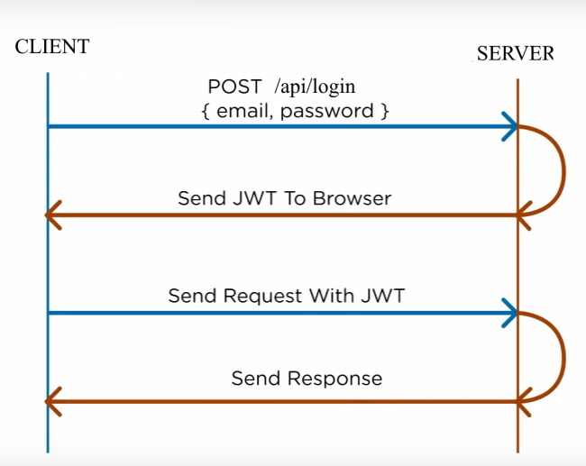

# JWTAuthentication
A simple JWT based authentication example using Asp.net core. JWT based authentication does not save client session in the server memory. Therefore, you can design a stateless architecture to run your API in multiple virutal machines with no session persistency. It is the best practice to use JWT based authentication for any API project. The JWT has all the information that a client needs to authorize itself to the server as long as the server secret signature hasn't been changed. In case, you want the traditional cookie based authentication, please find the repo here https://github.com/mail4hafij/CookieAuthentication.

How to run locally: After you build and run the project, use Postman (or other similar tools you are familier with) to make a login POST request to https://localhost:44322/api/Login. You should then get back a JWT value which you need to use to send your api request to https://localhost:44322/api/status as a token bearer.

Please do all the neccessary changes as you see it fit (i.e., email, password authentication with your database in SignInManager class).

